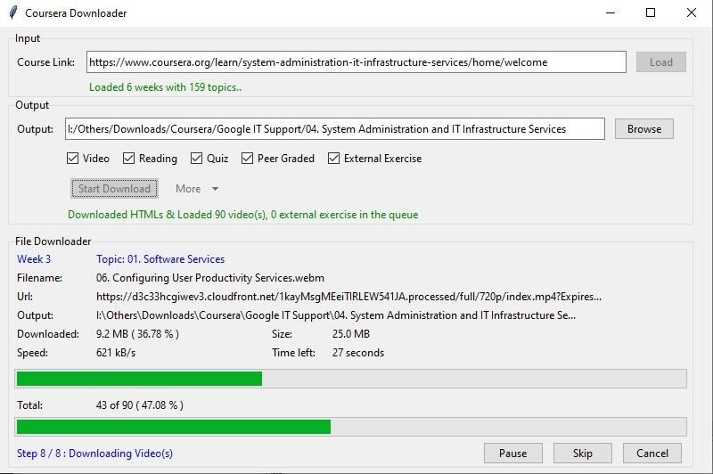

# Coursera Download

> Developed by: Asswad Sarker Nomaan

Coursera Download is a python based GUI program to download course videos & materials of your enrolled courses from your Coursera account. It uses selenium to scrap web data from coursera.

